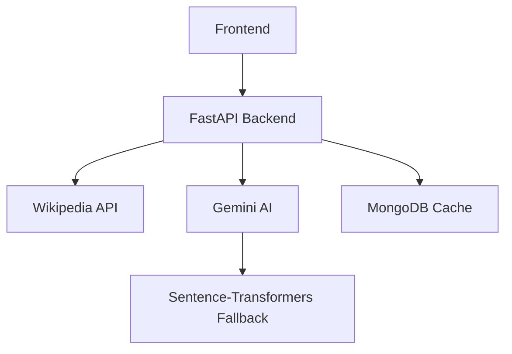

# Sorting Hat NLP and AI Project 🎩✨

An AI-powered Full-Stack application that sorts public figures or fictional characters into **Hogwarts Houses** 
(Harry Potter) or **Elemental Nations** (Avatar: The Last Airbender) 
based on their personality, history, and biographical data.

## 🚀 Key Features
- **Character Analysis**: Fetches real biographical data using the **Wikipedia API**.
- **Generative AI Sorting**: Utilizes **Google Gemini AI** (Flash 1.5/2.0)
    to perform deep semantic sorting and provide detailed reasoning for each result.
- **Graceful Degradation**: Includes a **Local NLP Fallback** using `Sentence-Transformers` 
   (vector similarity) to ensure the system works even if the AI service is unavailable.
- **Smart History**: Persistent storage with **MongoDB** ensures that once a character is sorted, 
    their result and reasoning are cached and retrieved instantly for future queries.
- **Dynamic UI**: A responsive web interface that dynamically changes its theme, colors,
    and animations based on the sorting result.

## 🛠️ Tech Stack
- **Backend**: Python 3.12, FastAPI, Uvicorn.
- **Design Patterns**: Implements **Strategy Pattern** \
  for universe switching and **Factory Pattern** for dynamic object instantiation.
- **AI/NLP**: Google GenAI (Gemini), Sentence-Transformers (`all-MiniLM-L6-v2`).
- **Database**: MongoDB (via Motor for asynchronous support).
- **Frontend**: HTML5, CSS3 (Custom Themes), Vanilla JavaScript.

## 📦 Installation & Setup

1. **Clone the repository**:
    ```bash
  git clone https://github.com/doronmerioz12-design/sorting-hat-project.git
    ```
   
2. **Set up a Virtual Environment**:
    python -m venv .venv
    # On Windows:
    .venv\Scripts\activate

3. **Install Dependencies**:
    pip install -r requirements.txt

4. **Environment Variables**:
   Create a `.env` file in the root directory and add your Gemini API key 
   (this file is excluded from Git for security):
   ```text
   GEMINI_API_KEY=your_actual_api_key_here
   
5. **Run the Server**:
    python server.py

The application will be available at `http://127.0.0.1:8000`.

## 🏗️ Architecture Note
This project was built with scalability in mind. By using the **Strategy Pattern**, the sorting logic is decoupled
from the API endpoints, allowing for easy integration of new universes (e.g., Star Wars, Lord of the Rings) 
without modifying existing core logic.

## 📝 Author
**Doron Merioz** - Computer Science Student at The Hebrew University of Jerusalem (HUJI).


